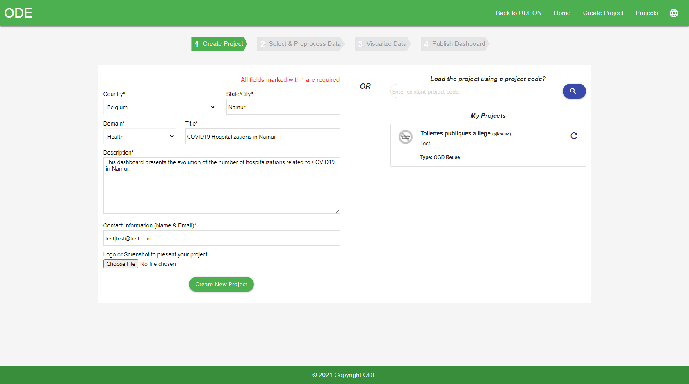
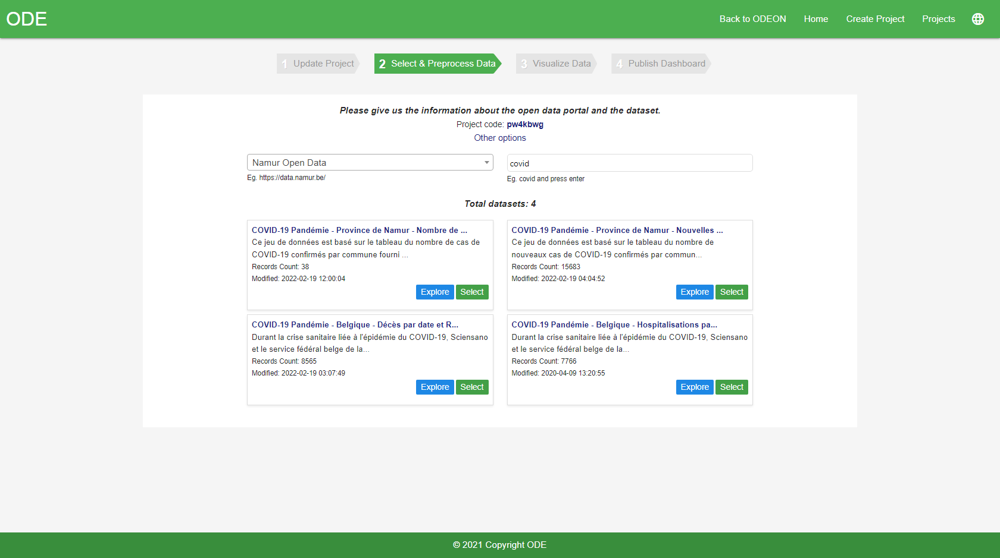
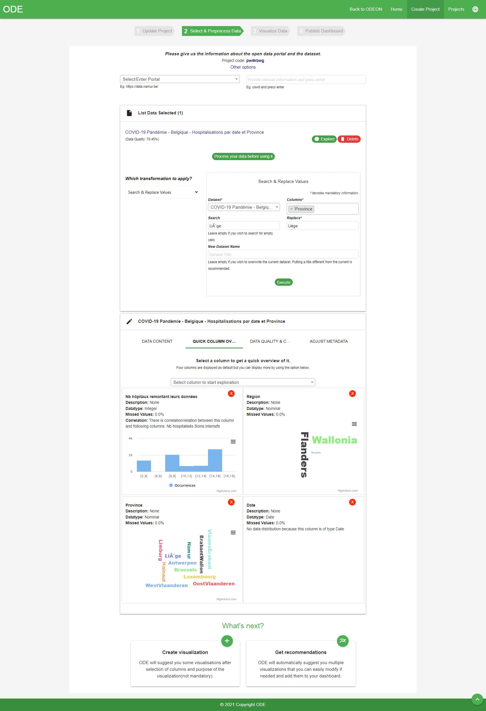
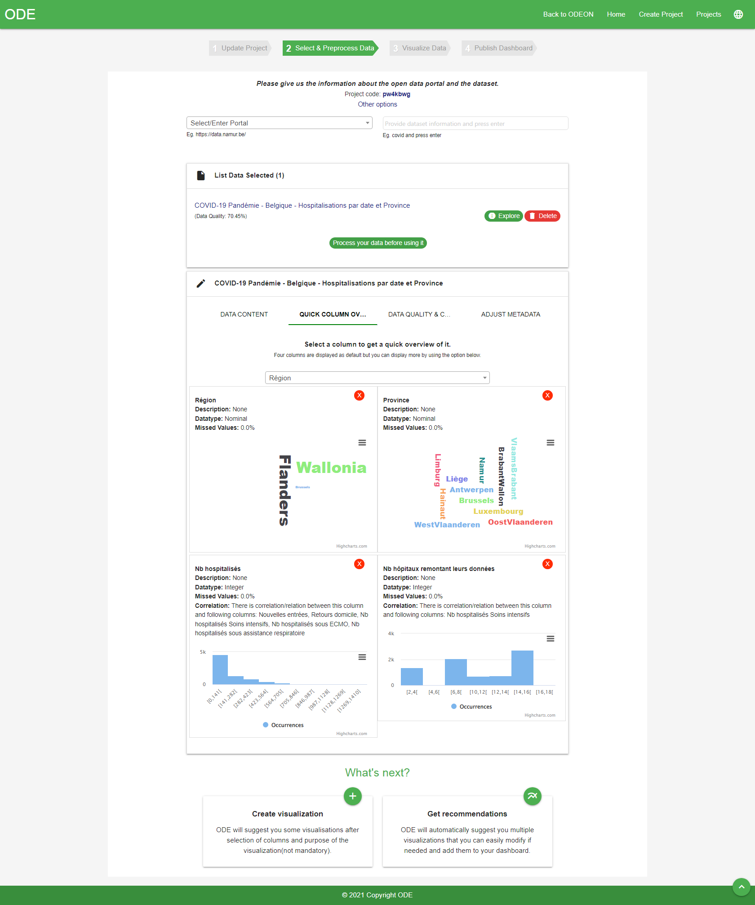
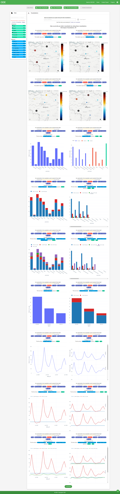
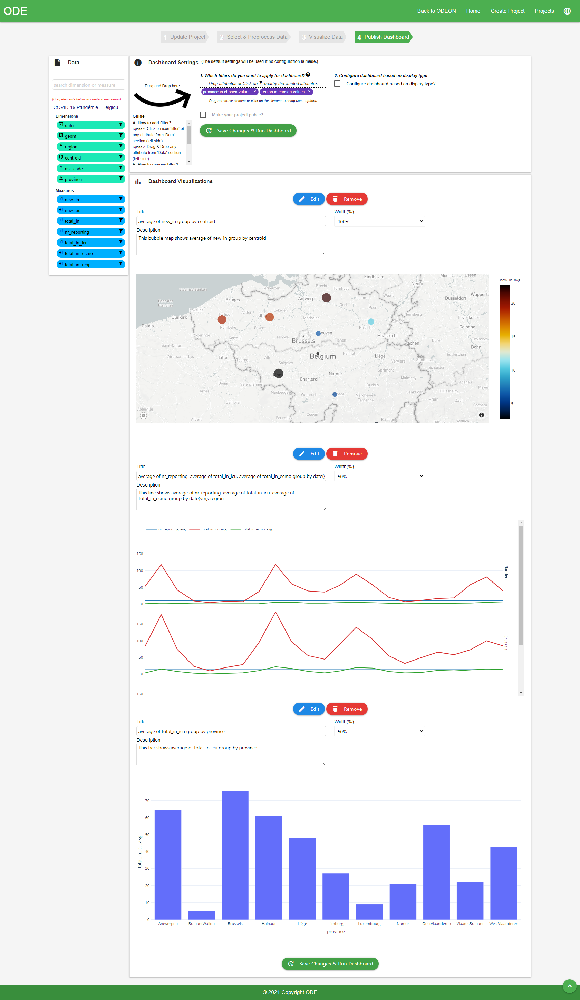
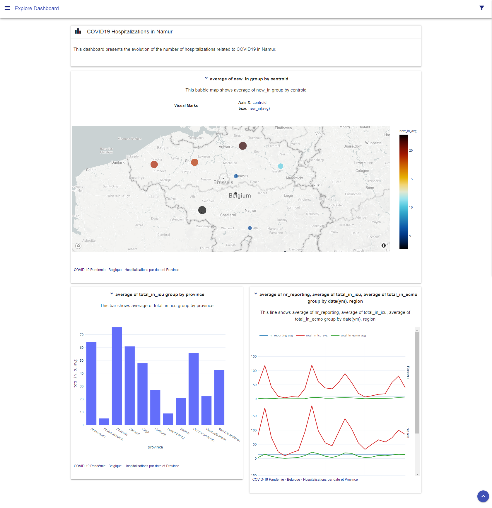

# ODE
Open Data Explorer (ODE) is a generic and end-to-end tool which helps users through the different data storytelling stages. A Video showing the steps performed by the an user to create story from COVID19 hospitalizations in Belgium collected from the Namur (Belgium) portal  is available at https://rb.gy/cor6qt.

## Screnshots (ODE Interface)

Create Project

Select Open Data

Data Processing

Data Overview

Recommendation Visualizations

Dasboard Settings

Dashboard
